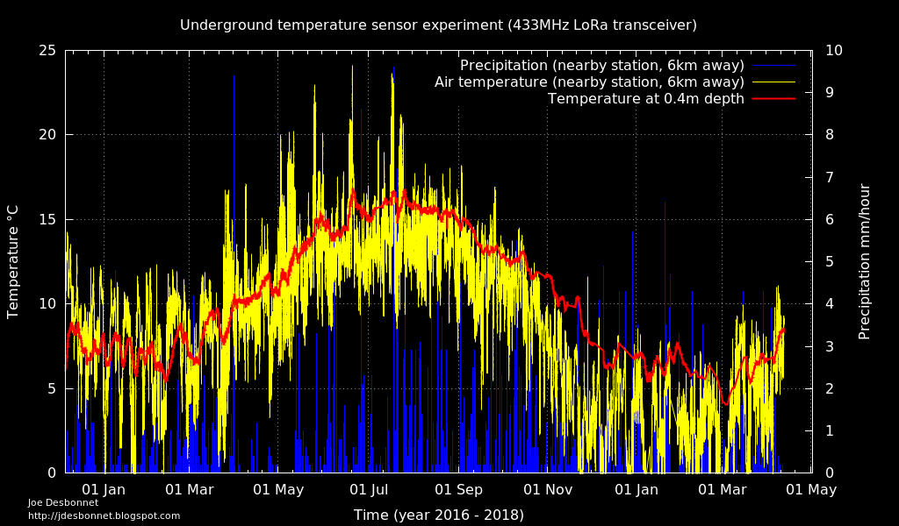
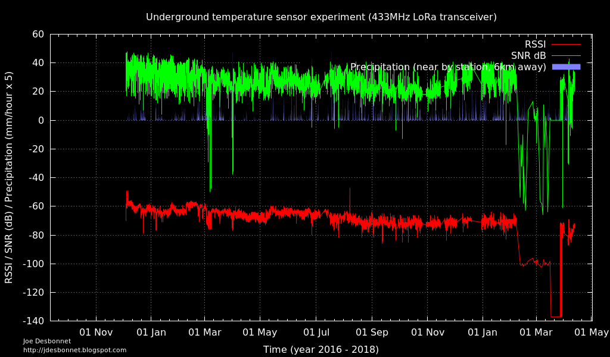

# Underground_Sensor_Experiment_1

Data from an experiment I'm conducting using low power LoRa (433MHz) radio buried under ground to relay soil temperature, humidity etc.

The sensor is buried about 0.5m underground in my garden. The receiver is located about 10m away in my home office overlooking the garden. The sensor measures temperature using a DS18B20 and relays that every 143 seconds.

The hardware is based on my LPC812/RFMxx experimentation board [1]  with a RFM95W LoRa [2] transceiver module powered by a 18650 sized lithium iron phosphate cell (LiFePO4). LiFePO4 is more suitable for directly powering 3.3V electronics with a discharge curve ranging from 3.4V to 2.8V compared to regular LiPo which runs from about 4.2V to 3.4V (voltage is too high for much of cycle).

The precipitation data is taken from a weather station about 6km away located at NUIG university. The precipitation data is available here [3].

## References

[1] https://github.com/jdesbonnet/RFM69_LPC812_firmware

[2] https://www.lora-alliance.org/

[2] https://github.com/jdesbonnet/NUIG_weather_station_data

