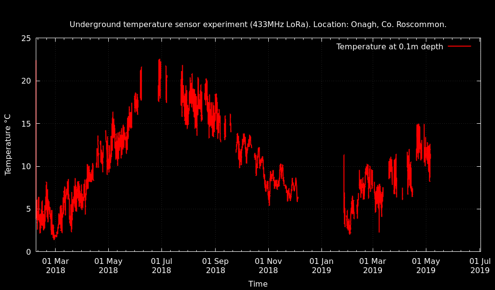

# Underground_Sensor_Experiment_1

Data from an experiment I'm conducting using low power LoRa (433MHz) radio buried under ground to relay soil temperature, humidity etc.

The sensor is buried about 0.4m underground in my garden. The receiver is located about 10m away in my home office overlooking the garden. The sensor measures temperature using a Maxim DS18B20 sensor and relays that every 143 seconds.

The hardware is based on my LPC812/RFMxx experimentation board [1]  with a RFM95W [2] LoRa [3] transceiver module powered by a 18650 sized lithium iron phosphate cell (LiFePO4). LiFePO4 is more suitable for directly powering 3.3V electronics because it has a discharge curve ranging from 3.4V to 2.8V compared to regular LiPo which runs from about 4.2V to 3.4V (the voltage is too high for most of the discharge cycle).

The precipitation data is taken from a weather station about 6km away located at NUIG university.

The power configuration for this experiment is not optimized for battery life. The radio is set at maximum transmission power and the LoRa parameters are such that a message requires about 1 second on air to transmit. The radio module consumes 100mA while transitting. So each message consumes (0.1/3600) amp-hours (Ah) of charge. The battery capacity is approx 1.5Ah. So a total of about 54000 messages, or 90 days of operation. The data so far shows that temperature 0.5m under ground varies slowly, so one message per hour is more than sufficient. Also I envisage an order of magnitude improvement in radio efficiency by tweeking the LoRa protocol transmit parameters. Together these improvements can extend battery life to years.

## Notes about sensor configuration

Firmware requires the following configuration:

  * Enable DS18B20 reading in param block (command "P 5 1").
  * Set poll interval to reasonably long time 5 - 15 minutes.
  * Set low power poll mode and save configuration (command "M 2 S")
  
## Log 

## 29 May 2018
Retrieved from ground. Vbat=2.724V. Recharging.

### 17 Mar 2018

Experimenting with using this sensor in a freezer. Will the -20°C temperatures affect battery performance? Seems not.

### 27 Feb 2018

Soil sensor at Onagh orientation flipped to horizonal and completely burried now. Since 09:00 Monday 26 Feb 2018.

### 7 Feb 2018

A second sensor has been deployed at Onagh, Co. Roscommon (53.406864,-8.131192) at depth 10cm. Using
Tur Uisce receiver station out there. Replacement 
receiver for Tur Uisce not in place yet, so only one or two readings per day form this location until a
new receiver in put in place.

### 21 Jan 2018

Verified for the first time two-way communications (just never got around to it until now). Issued over the air
wake command and changed the sampling period and returned to low power mode. Everything worked as expected.
It was observed that having the receiver on for a few minutes increased the temperature slightly (by about 0.2C). 
The receiver consumes about 20mA (about 60mW) so this wasn't surprising.

### 30 Dec 2017

Server down over holiday period. I was away so couldn't reset. Data loss of a little over a week.

### 18 Jul 2017

Disruptions to data receiption due to host computer UART problems at receiver station in mid-July 2017. 
Sensors, radio hardware and radio firmware appear not to be at fault.

### 9 Apr 2017

Time should have been recorded in UTC, but is actuall in IST (with a +1 day light saving time offset from UTC after 26 Mar 2017.

### 5 Apr 2017

Device with active 3G radio placed close to receiving station from about midday 4 Apr to 17:00 5 Apr. Has had a noticable 
effect on SNR.

### 17 Mar 2017

Data missing for about 18 hours due to unscheduled server re-boot.

### 27 Feb 2017 

Telemetry indicated that there was at most a few days of battery life left. Dug up sensor at about 16:30, 
replaced LiFePO4 cell with an identical fully-charged cell. Cell  voltage was found to be 2.447V before replacement. 

Also updated firmware from version 0.7.1 to 0.7.3. This version fixes a power management bug (Issue #13) which should significantly improve battery life. Issue #13 caused the first sleep cycle after boot/reset not to be in full deep sleep mode. Instead it was consuming in excess of 1mA (when it should have been consuming only 4µA). Because the watchdog timer resets the device every few hours this bug caused a significant waste of battery capacity. It was expecially significant at the end of the battery discharge cycle when the polling period is extended by a factor of 8. It meant that every few hours the unit drew over 1mA for an entire (long) sleep cycle.

It was found that the unit transmitted 49460 messages from start of experiment (4 Dec 2016) which
agrees reasonably well with my projected estimate of 54000 messages.  

The depth of sensor was re-measured. Surface to top of outer jar: 28cm. Height of jar 17cm, which would put the sensor at about depth of about 40cm. 

Firmware file RF9x_0.7.3.bin (SHA256 a10bc2c3f7cda16a02d4500f7b653b8fa19b2cfea7b436cc161ccf47905c4a29).

### 4 Dec 2016

Sensor buried. Experiment started.

## References

[1] https://github.com/jdesbonnet/RFM69_LPC812_firmware

[2] http://www.hoperf.com/upload/rf/RFM95_96_97_98W.pdf

[3] https://www.lora-alliance.org/

